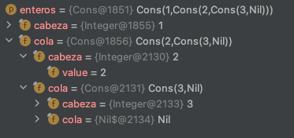

# NTP: Práctica Final


📇 Índice de contenido
> - [NTP: Práctica Final](#ntp--pr-ctica-final)
>  * [1. Integración con el entorno de desarrollo](#1-integraci-n-con-el-entorno-de-desarrollo)
>  * [2. Valoración de la práctica](#2-valoraci-n-de-la-pr-ctica)
    + [Ejercicio Conjunto](#ejercicio-conjunto)
    + [Ejercicio List](#ejercicio-list)


## 1. Integración con el entorno de desarrollo

Se ha utilizado **IntelliJ IDEA** con el plgin de Scala para que reconozca la sintaxis de este lenguaje. Adjunto el árbol de directorios generado:

```
.
├── build.sbt
├── project
│   └── build.properties
└── src
    ├── main
    │   └── scala
    │       ├── Conjunto.scala
    │       ├── Lista.scala
    │       └── Main.scala
    └── test
        └── scala
            ├── ConjuntoTest.scala
            └── ListaTest.scala

6 directories, 7 files
```

Y se ha generado el ZIP utilizando el menú del propio IDE: `File > Export > Project to ZIP File…` La carpeta **P3** es la que tiene el proyecto de **IntelliJ IDEA**

## 2. Valoración de la práctica

### Ejercicio Conjunto

Me ha parecido muy divertido este ejercicio, me ha gustado mucho volver a recordar la experiencia de coger un papel y dibujar diagramas de Venn para pensar como programar las funciones del conjunto.

He decidido programar todas las funciones como métodos de la clase `Conjunto` ya que me parecía muy lógico utilizarlas como `objeto.filtrar(``(x : Int) => x < 0)`. Sin embargo, he tenido que crear un object para definir el límite del conjunto y el método `conjuntoUnElemento(elementoUnico: Int): Conjunto` ya que he estimado que es una operación que no necesita una instancia para hacerse (es para mi lo equivalente a un static de Java)

En este ejercicio he visto realmente útil realizar tests para probar unitariamente cada una de las funcionalidades, me he dado cuenta que hacer tests y poder probar distintas casuhísticas te permite evitar pequeños fallos en tu implementación.

### Ejercicio List

Al principio me ha costado un poco realizar algunos de los métodos recursivamente porque no tenía muy claro como está formado el modelo, me ha resultado difícil de entender al principio. Gracias al IDE que tiene un estupendo depurador, he podido descubrir la composicion `Cons(1, Cons(2, Nil))` representa a la lista `[1, 2].` Como dije en la anterior memoria, debuguear junto con la realización de pequeños tests unitarios, ayuda mucho a entender como funciona tu código y por tanto a mejorarlo.



Respecto al diseño base, `sealed trait Lista[+A]` el digno más es una sofisticación que nos permite hacerla un supertipo. E.g: crear una lista de `Nothing`.


> 👨🏻‍💻 Práctica realizada por **Pablo Jiménez**  <a href="mailto:pablojjimenez0@gmail.com"></a>
